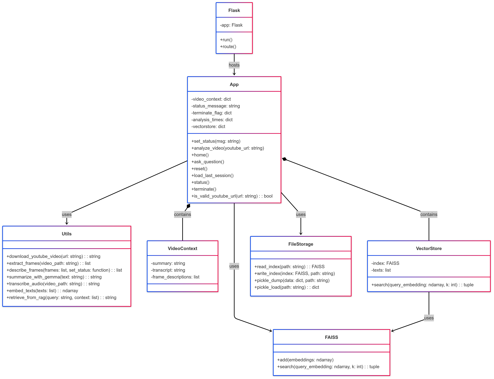
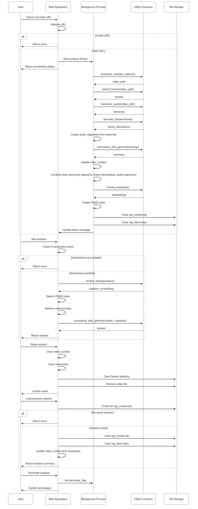
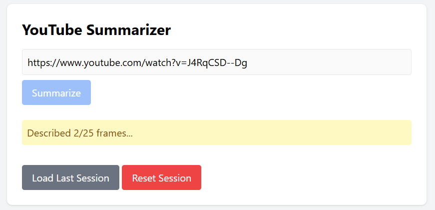

# YouTube Frame Analyser

YouTube Frame Analyser is a Flask-based application that processes YouTube videos to extract transcripts, summarize content, and enable interactive Q&A using a multimodal Retrieval-Augmented Generation (RAG) pipeline. The application integrates video frame extraction, audio transcription, and embedding-based retrieval for efficient question answering.



---

## Features

- **YouTube Video Processing**: Downloads YouTube videos and extracts frames and audio.
- **Audio Transcription**: Converts video audio to text using Whisper.
- **Frame Descriptions**: Generates detailed descriptions of video frames using an LLM.
- **Summarization**: Summarizes the transcript using an LLM.
- **Interactive Q&A**: Allows users to ask questions about the video using a RAG pipeline.
- **Session Management**: Supports saving and loading sessions for persistence across server restarts.
- **Reset Functionality**: Clears all processed data, including frames and embeddings.

---

## Requirements

- Python 3.8 or higher
- Required Python libraries:
  - `Flask`
  - `yt-dlp`
  - `opencv-python`
  - `whisper`
  - `sentence-transformers`
  - `ollama`
  - `numpy`

---

## Installation

1. Clone the repository:
   ```bash
   git clone https://github.com/your-repo/youtubedeepseek.git
   cd youtubedeepseek
   ```

2. Create a virtual environment and activate it:
   ```bash
   python -m venv venv
   source venv/bin/activate  # On Windows: venv\Scripts\activate
   ```

3. Install dependencies:
   ```bash
   pip install -r requirements.txt
   ```

4. Ensure `ffmpeg` is installed and added to your system's PATH.

---

## Usage

1. Start the Flask server:
   ```bash
   python app.py
   ```

2. Open your browser and navigate to:
   ```
   http://localhost:5000
   ```

3. Use the interface to:
   - Enter a YouTube URL and click "Summarize" to process the video.
   - Ask questions about the video using the Q&A interface.
   - Reset the session or load the last saved session.

---

## File Structure

- `app.py`: Main Flask application.
- `utils.py`: Utility functions for video processing, transcription, summarization, and RAG.
- `templates/index.html`: Frontend HTML interface.
- `frames/`: Directory where extracted video frames are stored.
- `rag_context.pkl`: File used to persist RAG context across sessions.

---

## Key Functions

### `utils.py`

- **`download_youtube_video(url, filename="video.mp4")`**: Downloads a YouTube video.
- **`extract_frames(video_path, output_folder="frames", frame_interval=5)`**: Extracts frames from the video.
- **`transcribe_audio(video_path)`**: Transcribes audio using Whisper.
- **`describe_frames(frame_paths, set_status=None, prompt="Describe this image in detail:")`**: Generates descriptions for video frames.
- **`summarize_with_gemma(text)`**: Summarizes text using an LLM.
- **`embed_texts(texts)`**: Embeds text for RAG using Sentence Transformers.
- **`retrieve_from_rag(query, texts, embeddings, top_k=3)`**: Retrieves relevant context for a query.

---

## Session Management

- **Save Session**: The RAG context is saved to `rag_context.pkl` after processing a video.
- **Load Session**: Use the "Load Last Session" button to restore the last saved session.
- **Reset Session**: Clears all processed data, including frames and embeddings.

---

## Troubleshooting

### Common Errors

1. **`NameError: name 'ollama_client' is not defined`**
   - Ensure `ollama_client` is initialized in `utils.py` or `app.py`:
     ```python
     ollama_client = ollama.Client(host='http://localhost:11434')
     ```

2. **`RuntimeError: cannot reshape tensor of 0 elements`**
   - Ensure valid frames and transcript are generated before embedding:
     ```python
     if not frames:
         return jsonify({"error": "No frames extracted."}), 400
     if not transcript.strip():
         return jsonify({"error": "No transcript generated."}), 400
     ```

3. **`KeyError: 'texts'`**
   - Ensure a video is processed before using the Q&A feature.

---

## Future Enhancements

- Add support for more video formats.
- Improve frame selection for better descriptions.
- Integrate a database for persistent storage of RAG data.
- Add real-time progress bars for long-running tasks.

---

## License

This project is licensed under the MIT License. See the `LICENSE` file for details.

---

## Acknowledgments

- [OpenAI Whisper](https://github.com/openai/whisper) for audio transcription.
- [Sentence Transformers](https://www.sbert.net/) for embedding-based retrieval.
- [yt-dlp](https://github.com/yt-dlp/yt-dlp) for YouTube video downloads.
- [Ollama](https://ollama.ai/) for LLM-based summarization and frame descriptions.
